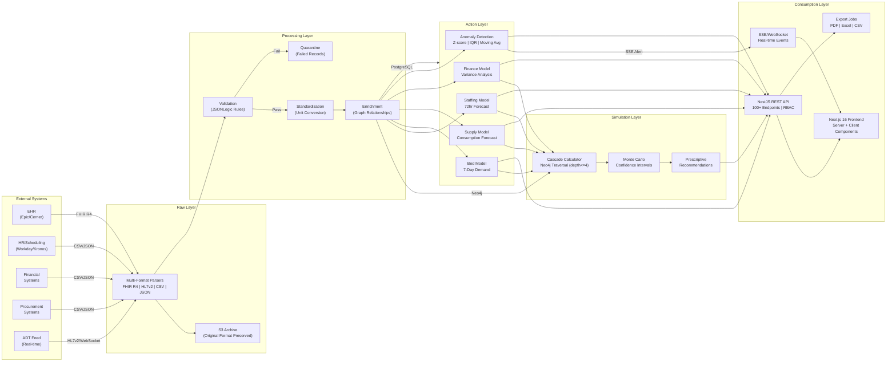
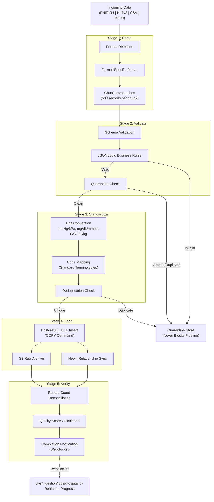
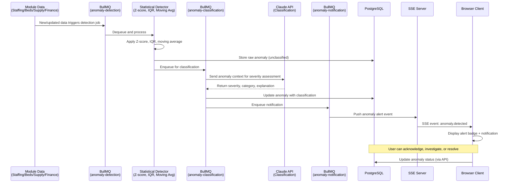
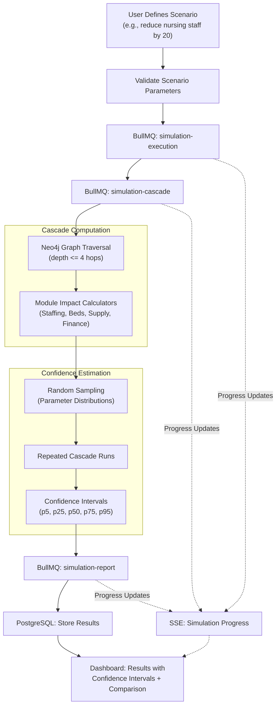

# Data Flows

## Overview

This document describes the end-to-end data flows within MedicalPro, the Clinical Analytics OS for Farrer Park Hospital. It covers how data enters the platform, how it is transformed and enriched through progressive pipeline zones, where it is stored, and how it is consumed by users and downstream systems.

MedicalPro processes hospital operational data across five core domains (staffing, bed allocation, supply chain, revenue/cost analysis, anomaly detection) through a four-layer zone architecture before surfacing predictive and prescriptive intelligence. The platform is deployed on AWS Singapore to satisfy data residency requirements.

For the high-level component architecture and design principles, see [overview.md](./overview.md). For security controls governing these data flows, see [security-governance.md](./security-governance.md). For strategic context, see [Data Platform Strategy](../project-context/data-platform-strategy.md).

---

## 1. End-to-End Data Flow

### 1.1 High-Level Data Flow Diagram



### 1.2 Four-Layer Zone Architecture

All data flows through four progressive refinement zones. Quality is measured at every zone boundary, and raw data is preserved for reprocessability and audit compliance.

| Zone | Purpose | Storage | Key Operations |
|---|---|---|---|
| **Raw** | Original format preserved. No transformations applied. | S3 (archive), PostgreSQL (metadata) | Format parsing (FHIR R4, HL7v2, CSV, JSON). Raw payload archived to S3 for 7-year retention and reprocessability. |
| **Processing** | Validated, standardized, enriched data ready for analytics. | PostgreSQL (operational), Neo4j (relationships) | JSONLogic validation rules. Unit conversion (mmHg/kPa, mg/dL/mmol/L, Fahrenheit/Celsius, lbs/kg). Failed records quarantined immediately. Graph relationships established in Neo4j. Orphan detection via Neo4j traversal. |
| **Action** | Module-specific predictive model outputs. | PostgreSQL (predictions), Redis (hot cache) | Staffing 72-hour forecast, bed 7-day demand, supply consumption forecast, financial variance analysis, anomaly detection (Z-score, IQR, moving average). |
| **Simulation** | What-if scenario results and prescriptive recommendations. | PostgreSQL (results), Neo4j (traversal) | Cascade computation via Neo4j traversal (depth <=4). Monte Carlo confidence intervals. Prescriptive recommendations with composite scoring. |

---

## 2. Data Ingestion Patterns

### 2.1 Multi-Format Parsing

The ingestion pipeline accepts four data formats, each with a dedicated parser:

| Format | Resources/Types | Source Systems |
|---|---|---|
| **FHIR R4** | Patient, Encounter, Observation, Claim, Procedure | EHR systems (Epic, Cerner) |
| **HL7v2** | ADT messages (A01 Admit, A02 Transfer, A03 Discharge) | Hospital ADT feed |
| **CSV** | Flat-file exports (staffing schedules, inventory lists, financial ledgers) | HR, procurement, finance systems |
| **JSON** | Structured API payloads, configuration imports | Various integration endpoints |

### 2.2 Ingestion Pipeline Stages



### 2.3 Ingestion Processing Model

**Quarantine-first principle**: Invalid records are quarantined immediately upon detection. They never block the pipeline and never contaminate downstream analytics. Quarantined records are available for review and reprocessing through the data governance dashboard (see [Module 8 story](../stories/08-view-data-quality-governance-dashboard.md)).

**Stream processing in chunks**: Incoming data is chunked into batches of 500 records for stream processing. This balances throughput with memory consumption and enables progress reporting at the chunk level.

**Bulk insert via PostgreSQL COPY**: Validated and standardized records are loaded into PostgreSQL using the `COPY` command for maximum write throughput, bypassing row-level INSERT overhead.

**Target throughput**: 10,000 records/minute sustained ingestion rate.

**Real-time progress**: WebSocket endpoint `/ws/ingestion/jobs/{hospitalId}` delivers chunk-level progress updates to the frontend during active ingestion jobs.

**Pipeline stages**: Parse, Validate, Standardize, Load, Verify. Each stage is independently instrumented for monitoring, and failures at any stage do not halt subsequent stages for other records in the batch.

### 2.4 Ingestion as a BullMQ Job

Each ingestion operation is enqueued as an `ingestion-job` in BullMQ. This provides:
- Retry semantics (3 attempts with exponential backoff)
- Dead-letter queue for permanently failed jobs
- Concurrency control to prevent database overload
- Job progress tracking via WebSocket

For detailed ingestion implementation, see [Module 9 implementation plan](../implementation-plans/09-validate-and-standardize-incoming-data.md).

---

## 3. Data Transformation and Processing Pipeline

### 3.1 BullMQ Job Queue Architecture

All asynchronous processing runs through BullMQ, backed by Redis. The system defines 24 queue types organized by function:

| Category | Queue Names | Priority | Typical Trigger |
|---|---|---|---|
| **Predictions** | `staff-prediction`, `bed-forecast`, `supply-demand-forecast`, `financial-analysis` | Medium | Scheduled (post-ingestion), on-demand |
| **Anomaly** | `anomaly-detection`, `anomaly-classification`, `anomaly-notification` | High | Post-prediction, continuous monitoring |
| **Simulation** | `simulation-execution`, `simulation-cascade`, `simulation-report` | Medium | User-initiated scenario |
| **Quality** | `quality-assessment`, `quality-report`, `audit-log` | Low | Post-ingestion, scheduled |
| **Ingestion** | `ingestion-job`, `order-optimization`, `expiration-scanner` | Medium | Upload trigger, scheduled (daily 2 AM for expiration) |
| **Intelligence** | `generate-recommendations`, `evaluate-outcome`, `update-learning-model` | Medium | Post-prediction, monthly learning loop |
| **Reports** | `report-generation` | Low | User-initiated export |

**Retry policy**: All queues use 3 attempts with exponential backoff. Failed jobs after all retries are moved to dead-letter queues for manual inspection and replay.

**Priority queues**: Anomaly detection and notification queues run at high priority to minimize alert latency. Report generation runs at low priority to avoid contention with operational workloads.

### 3.2 Processing Pipeline Flow

Data transformation follows a predictable sequence through the zone architecture:

1. **Ingestion job completes** -- New validated data lands in PostgreSQL and Neo4j.
2. **Prediction jobs triggered** -- Module-specific prediction queues (`staff-prediction`, `bed-forecast`, `supply-demand-forecast`, `financial-analysis`) are enqueued.
3. **Anomaly detection triggered** -- The `anomaly-detection` queue scans new and existing data across all modules using statistical methods (Z-score, IQR, moving average deviation).
4. **Claude classification** -- Detected anomalies are enqueued to `anomaly-classification` for Claude API severity assessment and plain-language explanation.
5. **Notification dispatched** -- Classified anomalies are enqueued to `anomaly-notification` for SSE delivery to connected clients.
6. **Recommendations generated** -- The `generate-recommendations` queue produces prescriptive recommendations from prediction outputs, scored by a composite formula (revenue 30%, patient safety 25%, cost savings 20%, efficiency 15%, compliance 10%).
7. **Quality assessment** -- The `quality-assessment` queue computes data quality scores at each zone boundary.
8. **Audit logging** -- The `audit-log` queue records all data mutations, job executions, and user actions to the append-only audit log.

### 3.3 Transformation Details by Zone

**Raw to Processing**:
- JSONLogic validation rules check schema completeness, data type correctness, and business rule compliance (e.g., admission date must precede discharge date).
- Unit standardization converts measurements to SI defaults: pressure to mmHg, glucose to mg/dL, temperature to Celsius, weight to kg. Original values and units are preserved alongside standardized values.
- Graph relationships are established in Neo4j: department adjacency, patient-department associations, supplier-item-department edges, staff-department assignments.
- Orphan detection identifies records that reference non-existent parent entities (e.g., an encounter referencing a non-existent patient).

**Processing to Action**:
- Staffing model ingests validated staff records, shift assignments, patient census, and regulatory constraints to produce 72-hour demand forecasts.
- Bed model combines historical admission trends, seasonal patterns, and current occupancy to produce 7-day demand forecasts.
- Supply model uses consumption rates, current inventory levels, and patient volume projections to forecast demand and flag expiration risks.
- Financial model computes period-over-period variance analysis and identifies top cost/revenue drivers.
- Anomaly detector applies three statistical methods (Z-score for distribution outliers, IQR for robust outlier detection, moving average deviation for trend breaks) across all module data.

**Action to Simulation**:
- Cascade calculator traverses the Neo4j dependency graph (depth <=4) from a user-defined scenario change point to compute downstream module impacts.
- Monte Carlo simulation runs repeated random samples to estimate confidence intervals around cascade predictions.
- Prescriptive recommendation engine synthesizes model outputs, cascade results, and hospital constraints into prioritized action items.

---

## 4. Data Storage Strategy

### 4.1 Storage Tiers

The platform uses a tiered storage strategy aligned with access frequency and latency requirements:

| Tier | Technology | Data Types | Access Pattern | Retention |
|---|---|---|---|---|
| **Hot** | PostgreSQL + Redis | Current operational state, active predictions, cached aggregations | Sub-second reads. Redis cache TTL 5--30 minutes. | Rolling window (current + recent) |
| **Warm** | PostgreSQL (partitioned) | Historical trends, audit logs, past predictions | Analytical queries, monthly partitions | Monthly partitions, online for reporting |
| **Cold** | PostgreSQL (compressed) + S3 | Raw data archives, aged audit logs, compliance records | Infrequent access, compliance lookups | 7-year retention (audit requirement) |
| **Graph** | Neo4j | Module dependencies, patient flow paths, supplier/substitution networks, department adjacency | Cypher traversal, 1--4 hop queries | Synced from PostgreSQL, relationship-focused |

### 4.2 Redis Caching Strategy

Redis serves as the hot cache layer with module-specific TTLs tuned to data volatility:

| Cache Key Pattern | TTL | Rationale |
|---|---|---|
| Staffing state (current shift, coverage) | 5 minutes | Shift changes are frequent; stale staffing data causes incorrect coverage calculations |
| Bed occupancy (real-time census) | 15 minutes | ADT events update occupancy; moderate TTL balances freshness with read load |
| Inventory levels | 10 minutes | Consumption updates are periodic; brief cache prevents redundant DB reads |
| Financial cost/revenue drivers | 1 hour | Financial data changes infrequently intra-day; longer TTL is safe |
| AI-generated narratives | 24 hours | Narratives are expensive to generate (Claude API call); regenerated only when underlying data changes significantly |
| NLP query results | 5 minutes | Short TTL because identical queries are rare; prevents stale answers |

Redis also backs all BullMQ queues and stores user session state. All Redis data is ephemeral and reconstructable from PostgreSQL.

### 4.3 PostgreSQL Storage Design

**Operational tables**: Normalized schema for transactional data (patients, encounters, staff, inventory, financials). Kimball dimensional model (output-first) ensures every stored field traces to a predictive model requirement.

**Materialized views**: Pre-computed aggregation views for consumption by the API and frontend. Refreshed hourly on a schedule. Financial aggregation views follow their own refresh schedule aligned with reporting periods.

**Monthly partitions**: Audit logs and historical trend data are partitioned by month. This enables efficient range queries for compliance reporting and controlled archival of aged partitions.

**Compressed storage**: Aged partitions are compressed in-place using PostgreSQL native compression. Combined with S3 archival of raw data, this minimizes storage cost for long-retention compliance data.

### 4.4 Neo4j Graph Storage

Neo4j stores relationship-heavy data that benefits from native graph traversal:

- **Module dependency graph**: Edges between staffing, beds, supply, finance, and anomaly modules with typed impact relationships. Traversed during simulation cascade computation.
- **Department adjacency**: Physical and logical proximity between hospital departments. Used for bed overflow routing and staff reallocation recommendations.
- **Patient flow paths**: Historical patient movement patterns between departments. Used for bed demand forecasting.
- **Supplier networks**: Supplier-item relationships with substitution edges and compatibility scores. Used for supply chain resilience analysis.
- **Orphan detection**: Traversal queries identify records without valid parent relationships (e.g., encounters without patients, items without suppliers).

Neo4j is synced from PostgreSQL via event-driven updates. PostgreSQL remains the authoritative source for all data. Neo4j is scoped strictly to relationship traversal -- it does not store operational attributes beyond what is needed for graph queries.

### 4.5 S3 Object Storage

S3 (AWS Singapore region) stores:
- **Raw data archives**: Original-format payloads (FHIR R4, HL7v2, CSV, JSON) as received, prior to any transformation. Enables full reprocessing if pipeline logic changes.
- **Cold audit archives**: Compressed audit log partitions older than the warm retention window.
- **Export artifacts**: Generated PDF, Excel, and CSV reports held temporarily for user download.

All S3 objects are encrypted at rest (AWS SSE-S3). Lifecycle policies manage transition from Standard to Infrequent Access and eventually Glacier for 7-year retention compliance.

---

## 5. Real-Time Data Patterns

### 5.1 Event Delivery Mechanisms

The platform uses two real-time delivery mechanisms, scoped to use cases where latency directly impacts decisions:

| Mechanism | Use Cases | Details |
|---|---|---|
| **Server-Sent Events (SSE)** | Anomaly alerts, simulation progress updates, NLP query streaming answers | Unidirectional server-to-client. 30-second heartbeat to maintain connection. Automatic reconnection with `Last-Event-ID`. |
| **WebSocket** | Ingestion job progress, ADT (Admit/Discharge/Transfer) events for bed occupancy | Bidirectional. Used where client needs to send acknowledgments or where event frequency is high. |

**Why not Kafka**: Full event streaming infrastructure (Kafka, Pulsar) is intentionally excluded. At single-hospital scale, the volume does not justify the operational complexity. BullMQ plus targeted SSE/WebSocket covers all current requirements. This decision is revisitable if the platform scales to multi-hospital deployments. See [overview.md](./overview.md) for the architectural decision record.

### 5.2 SSE Heartbeat and Reconnection

SSE connections emit a heartbeat comment every 30 seconds to prevent proxy/load-balancer timeouts. If a client disconnects, it reconnects with the `Last-Event-ID` header, and the server replays any missed events from a short-lived Redis buffer. This ensures no anomaly alert or simulation progress update is lost during transient network interruptions.

### 5.3 Real-Time Anomaly Detection Flow



### 5.4 ADT Real-Time Bed Tracking

ADT (Admit/Discharge/Transfer) events arrive via WebSocket from the hospital ADT feed. Each event updates bed occupancy state in PostgreSQL and invalidates the Redis occupancy cache (15-minute TTL). The updated occupancy is broadcast to connected dashboard clients via WebSocket, enabling real-time bed status visualization without polling.

---

## 6. Data Access and Consumption Patterns

### 6.1 API Layer (NestJS)

The NestJS API layer exposes 100+ REST endpoints across 13 modules, all versioned under `/api/v1/`. Access is governed by role-based access control (RBAC) with the following roles: administrator, director, data_administrator, finance_analyst, implementation_consultant.

**Rate limiting**:
- NLP queries: 30 per user per hour, 200 per hospital per hour.
- Standard API endpoints: Higher limits appropriate to operational use.

**Financial data controls**: Financial endpoints are restricted to DIRECTOR, CFO, and FINANCE_ANALYST roles. All financial API responses include `Cache-Control: no-store` to prevent browser caching of sensitive figures. Export artifacts (PDF, Excel) are watermarked with the requesting user's identity.

### 6.2 Frontend Data Fetching

The Next.js 16 frontend (App Router, React 19) uses a dual-fetching strategy:

| Component Type | Data Fetching | Use Case |
|---|---|---|
| **Server Components** (default) | Direct API call during server-side render | Initial page load: executive dashboard, module overview pages, static layouts. Data is fresh on every navigation. |
| **Client Components** (`'use client'`) | React Query with cache invalidation | Interactive elements: charts (Recharts, D3.js), scenario builders, real-time feeds, form inputs. Enables optimistic updates, background refetching, and stale-while-revalidate patterns. |

SSE and WebSocket connections are established from client components to receive real-time anomaly alerts, simulation progress, and ingestion status updates.

### 6.3 Export Pipeline

All export operations run as background BullMQ jobs (`report-generation` queue) to avoid blocking the API:

| Format | Technology | Details |
|---|---|---|
| **PDF** | `@react-pdf/renderer` | Styled reports with hospital branding, charts rendered as images, financial watermarks |
| **Excel** | SheetJS | Multi-sheet workbooks with formatted headers, data validation, and formula preservation |
| **CSV** | Streaming writer | Large dataset export streamed directly to S3, download link provided on completion |

Export jobs are enqueued with low priority to avoid contention with operational prediction and anomaly workloads.

### 6.4 NLP Query Data Flow

Natural language queries follow a specialized data flow through Claude API tool-use:

1. **User submits question** in the analytics query interface (e.g., "Which department had the highest overtime cost last month?").
2. **Claude decomposes** the question into structured operations using tool-use (function calling). Claude selects the appropriate data source (SQL for tabular data, Cypher for relationship queries) and generates the query.
3. **Query routing**: SQL queries execute against PostgreSQL; Cypher queries execute against Neo4j.
4. **Answer synthesis**: Claude receives the query results and generates a natural language answer with supporting data.
5. **Streaming rendering**: The answer is streamed to the client via SSE, rendering progressively as tokens arrive.
6. **Caching**: Results are cached in Redis with a 5-minute TTL. Identical repeat queries within the window are served from cache.

Rate limits (30/user/hr, 200/hospital/hr) are enforced at the API layer to manage Claude API costs.

---

## 7. Module-Specific Data Flows

### 7.1 Staffing Module

```
HR/Scheduling Systems
    --> Ingestion (CSV/JSON parse, validate, standardize)
    --> PostgreSQL (staff records, shift assignments, patient census)
    --> Neo4j (staff-department assignments)
    --> BullMQ: staff-prediction (72-hour demand forecast)
    --> BullMQ: generate-recommendations (constraint-aware staffing suggestions)
    --> API: Recommendation delivered to dashboard
    --> User: Accept or dismiss recommendation
    --> BullMQ: evaluate-outcome (track recommendation effectiveness)
```

Staffing predictions run post-ingestion and on a recurring schedule. The recommendation engine respects regulatory nurse-to-patient ratios, budget constraints, and individual staff availability. Accepted/dismissed outcomes feed the monthly learning loop via the `update-learning-model` queue.

### 7.2 Bed Allocation Module

```
Hospital ADT Feed
    --> WebSocket ingestion (real-time HL7v2 ADT events: Admit, Discharge, Transfer)
    --> PostgreSQL (occupancy state update) + Redis cache invalidation
    --> WebSocket broadcast (real-time occupancy to dashboards)
    --> BullMQ: bed-forecast (7-day demand from admission trends + seasonal patterns)
    --> BullMQ: generate-recommendations (reallocation suggestions using Neo4j adjacency)
    --> API: Reallocation recommendation with revenue impact estimate
    --> User: Accept or dismiss
```

This is the only module with a true real-time ingestion path (WebSocket for ADT events). All other modules use batch ingestion. Bed demand forecasting uses historical admission trends and seasonal patterns to project 7-day demand by department.

### 7.3 Supply Chain Module

```
Procurement Systems
    --> Ingestion (CSV/JSON parse, validate, standardize)
    --> PostgreSQL (inventory records, consumption history, supplier data)
    --> Neo4j (supplier-item-department relationships, substitution networks)
    --> BullMQ: supply-demand-forecast (consumption-based demand projection)
    --> BullMQ: expiration-scanner (daily 2 AM scan for at-risk items)
    --> BullMQ: order-optimization (reorder quantity and timing)
    --> BullMQ: generate-recommendations (procurement suggestions)
    --> API: Recommendations delivered (reorder alerts, substitution suggestions)
    --> User: Accept or dismiss
```

The `expiration-scanner` queue runs daily at 2 AM, scanning inventory for items approaching expiration and flagging them for review or redistribution. Supplier substitution networks in Neo4j enable resilience recommendations when primary suppliers face disruptions.

### 7.4 Finance Module

```
Financial Systems
    --> Ingestion (CSV/JSON parse, validate, standardize)
    --> PostgreSQL (revenue lines, cost centers, budget allocations)
    --> BullMQ: financial-analysis (period-over-period variance computation)
    --> BullMQ: generate-recommendations (AI-generated narrative via Claude API)
    --> Claude API: Generate plain-English explanation of revenue/cost changes
    --> PostgreSQL: Store narrative + Redis cache (24-hour TTL)
    --> API: Financial summary, waterfall charts, drill-down data
    --> Frontend: Dashboard with no-store cache policy
    --> Export: Watermarked PDF/Excel via BullMQ report-generation
```

Financial data receives the strictest access controls: RBAC restricts endpoints to authorized roles, browser caching is disabled (`Cache-Control: no-store`), and all exports carry user identity watermarks. AI-generated narratives are cached for 24 hours in Redis to reduce Claude API calls, regenerated only when underlying financial data changes.

### 7.5 Anomaly Detection Module

```
All Module Data (Staffing, Beds, Supply, Finance)
    --> BullMQ: anomaly-detection (high priority)
        --> Statistical detection: Z-score, IQR, moving average deviation
    --> BullMQ: anomaly-classification (high priority)
        --> Claude API: Severity assessment, categorization, plain-language explanation
    --> BullMQ: anomaly-notification (high priority)
        --> SSE: Real-time alert pushed to connected clients
    --> PostgreSQL: Anomaly record stored with classification
    --> User: Acknowledge, investigate, or resolve
    --> Audit log: Status changes recorded
```

Anomaly detection runs across all modules -- it is not confined to a single data domain. All three anomaly queues (`anomaly-detection`, `anomaly-classification`, `anomaly-notification`) run at high priority to minimize the time between data change and alert delivery. For the detailed anomaly detection story, see [Module 5 story](../stories/05-detect-operational-anomalies.md).

### 7.6 Simulation Module



Simulation execution proceeds through three BullMQ queues in sequence:
1. `simulation-execution`: Validates parameters and initializes the scenario.
2. `simulation-cascade`: Traverses the Neo4j dependency graph from the change point (depth <=4) and computes module-specific impacts using dedicated impact calculators.
3. `simulation-report`: Runs Monte Carlo sampling to produce confidence intervals, stores results, and generates comparison views.

SSE streams progress updates throughout the computation so users see intermediate results. For the full simulation story, see [Module 6 story](../stories/06-run-what-if-foresight-simulations.md).

### 7.7 NLP Analytics Query Module

```
User: Natural language question
    --> API: Rate limit check (30/user/hr, 200/hospital/hr)
    --> Claude API (tool-use): Decompose question into structured operations
        --> Tool selection: SQL query (PostgreSQL) or Cypher query (Neo4j)
        --> Query generation and execution
    --> Claude API: Synthesize answer from query results
    --> SSE: Stream answer tokens to client
    --> Redis: Cache result (5-minute TTL)
    --> Frontend: Progressive rendering of streaming answer
```

Claude uses tool-use (function calling) to decompose natural language questions into executable queries. The decomposition step determines whether the question requires tabular data (routed to PostgreSQL via SQL) or relationship traversal (routed to Neo4j via Cypher). Answers are streamed via SSE for responsive rendering. For the full NLP query story, see [Module 10 story](../stories/10-query-hospital-data-natural-language.md).

---

## 8. Data Flow Governance

### 8.1 Quality Gates

Quality is assessed at every zone boundary:

| Boundary | Quality Checks |
|---|---|
| Raw to Processing | Schema completeness, data type correctness, JSONLogic business rule compliance, orphan detection |
| Processing to Action | Standardization completeness, deduplication verification, referential integrity, graph relationship consistency |
| Action to Simulation | Prediction confidence thresholds, model staleness check, input data recency verification |

Quality scores are computed by the `quality-assessment` BullMQ queue and surfaced in the data governance dashboard. See [Module 8 implementation plan](../implementation-plans/08-view-data-quality-governance-dashboard.md).

### 8.2 Audit Trail

All data mutations, job executions, user actions, and system events are recorded in a hash-chained, append-only audit log. The log is partitioned monthly in PostgreSQL and archived to S3 after the warm retention window. 7-year retention satisfies healthcare regulatory requirements.

The `audit-log` BullMQ queue processes audit entries asynchronously to avoid adding latency to primary data operations.

### 8.3 Data Lineage

Every record maintains lineage metadata:
- **Source system** and original format
- **Ingestion job ID** linking to the batch that introduced it
- **Transformation history** (validation status, standardization conversions applied)
- **Prediction lineage** (which model version produced which output)

This lineage enables end-to-end traceability from a dashboard metric back to the raw source record, supporting both debugging and compliance requirements.

---

## Cross-References

- **Architecture Overview**: [overview.md](./overview.md) -- High-level component architecture, design principles, and architectural decision records.
- **Security and Governance**: [security-governance.md](./security-governance.md) -- Authentication, encryption, RBAC details, and compliance controls governing these data flows.
- **Data Platform Strategy**: [data-platform-strategy.md](../project-context/data-platform-strategy.md) -- Business requirements, strategic decisions, and the output-first data design rationale.
- **Risk and Constraint Register**: [risk-constraint-register.md](../project-context/risk-constraint-register.md) -- Risk landscape and constraints affecting data flow design.
- **Module Implementation Plans**: [implementation-plans/](../implementation-plans/) -- Detailed per-module implementation specifications.
- **User Stories**: [stories/](../stories/) -- User-facing feature stories for each module.
