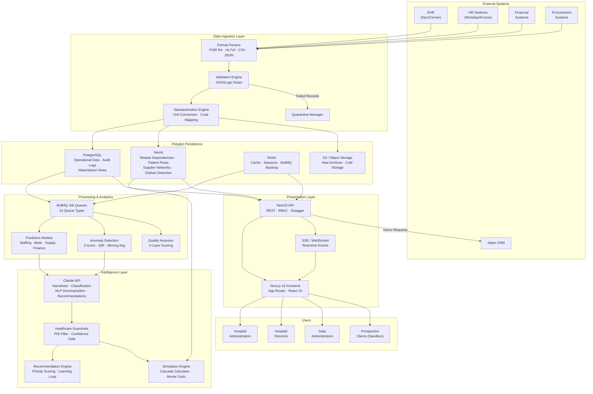

# Platform Architecture Overview

## Executive Summary

MedicalPro is a Clinical Analytics Operating System designed for Farrer Park Hospital and the broader Southeast Asian healthcare market. It transforms fragmented hospital operational data into predictive and prescriptive intelligence across five core domains: staff allocation, bed management, supply chain, revenue/cost analysis, and anomaly detection.

The platform's architectural identity is defined by three capabilities that distinguish it from conventional healthcare dashboards:

1. **Foresight Simulation** — A graph-traversal engine that computes cascading cross-module impacts of operational decisions before they are executed.
2. **AI-Augmented Analytics** — Claude API powers natural language queries, financial narratives, anomaly classification, and prescriptive recommendations, with healthcare-specific guardrails.
3. **Output-First Data Design** — Every data field is traced back to the predictive model output it enables, ensuring hospitals ingest only the data that drives actionable analytics.

The architecture follows a four-layer zone-based data pipeline (Raw → Processing → Action → Simulation), a polyglot persistence strategy (PostgreSQL + Neo4j + Redis), and a batch-plus-targeted-real-time processing model. It is deployed on AWS (Singapore region) to satisfy data residency requirements.

---

## High-Level Logical Architecture

---

## Major Components and Their Relationships

### 1. Data Ingestion Pipeline

The single entry point for all external data. Accepts FHIR R4, HL7v2, CSV, and JSON formats. Records pass through format parsing, JSONLogic validation, unit standardization, and graph relationship establishment before being loaded into storage. Invalid records are quarantined immediately, never blocking the pipeline. Target throughput: 10,000 records/minute.

**Feeds into**: PostgreSQL (operational data), Neo4j (relationships), S3 (raw archives), Quality Assessor.

### 2. Polyglot Persistence Layer

Three storage technologies serve distinct access patterns:

| Store | Role | Access Pattern |
|---|---|---|
| **PostgreSQL** | Primary operational and analytical store. Dimensional models (Kimball). Materialized views for aggregations. Monthly-partitioned audit log (7-year retention). | OLTP reads/writes, analytical queries via materialized views |
| **Neo4j** | Cross-module dependency graph. Department adjacency, patient flow paths, supplier substitution networks, orphan detection. | Cypher traversal (1–4 hops), cascade impact computation |
| **Redis** | Hot cache (5–30 min TTL), session state, BullMQ job queue backing. | Sub-millisecond key-value reads, queue enqueue/dequeue |

PostgreSQL is the authoritative source for all operational data. Neo4j mirrors relationship structures via event-driven sync. Redis is ephemeral — all data is reconstructable from PostgreSQL.

### 3. BullMQ Job Processing

24 dedicated queue types handle asynchronous workloads with priority, retry (3 attempts, exponential backoff), and dead-letter handling. Key queues:

| Queue Category | Queues | Priority |
|---|---|---|
| **Predictions** | staff-prediction, bed-forecast, supply-demand-forecast, financial-analysis | Medium |
| **Anomaly** | anomaly-detection, anomaly-classification, anomaly-notification | High |
| **Simulation** | simulation-execution, simulation-cascade, simulation-report | Medium |
| **Quality** | quality-assessment, quality-report, audit-log | Low |
| **Ingestion** | ingestion-job, order-optimization, expiration-scanner | Medium |
| **Intelligence** | generate-recommendations, evaluate-outcome, update-learning-model | Medium |
| **Reports** | report-generation, configuration-export | Low |

### 4. Predictive & Analytical Models

Module-specific predictive engines running as BullMQ jobs:

- **Staffing**: 72-hour demand forecasting with constraint-aware optimization (nurse-to-patient ratios, budget, availability).
- **Beds**: 7-day demand forecast from ADT admission trends and seasonal patterns.
- **Supply**: Consumption-based demand forecast with expiration tracking (daily 2 AM scan).
- **Finance**: Period-over-period variance analysis with driver identification.
- **Anomaly**: Multi-method detection (Z-score, IQR, moving average deviation, threshold, pattern recognition) across all modules.

### 5. Intelligence Layer

The AI tier combines statistical methods with Claude API:

- **Claude API**: Generates financial narratives, classifies anomaly severity, decomposes NLP queries into SQL/Cypher via tool-use, suggests field mappings, and generates prescriptive recommendation text.
- **Healthcare Guardrails**: Hard gate on all Claude outputs. Blocks PHI exposure, harmful queries, and low-confidence responses. No raw LLM output reaches users.
- **Simulation Engine**: Cascade calculator traverses Neo4j dependency graph (depth ≤4). Monte Carlo estimation computes confidence intervals. Module-specific impact calculators (staffing, beds, supply, finance).
- **Recommendation Engine**: Weighted composite scoring (revenue 30%, patient safety 25%, cost savings 20%, efficiency 15%, compliance 10%). Outcome tracking with monthly learning loop.

### 6. NestJS API Layer

RESTful API with NestJS decorators for:
- **RBAC**: Role-based access control (administrator, director, data_administrator, finance_analyst, implementation_consultant). Financial endpoints restricted to DIRECTOR/CFO/FINANCE_ANALYST.
- **Validation**: DTO-based request validation with class-validator.
- **Swagger**: Auto-generated API documentation.
- **SSE/WebSocket**: Real-time event delivery for anomaly alerts, simulation progress, and ingestion monitoring.
- **Rate Limiting**: 30 NLP queries/user/hour, 200/hospital/hour.

100+ API endpoints across 13 modules, versioned under `/api/v1/`.

### 7. Next.js Frontend

Next.js 16 with App Router and React 19:
- **Server Components** (default): Executive dashboard, module pages, static layouts.
- **Client Components** (`'use client'`): Interactive charts (Recharts, D3.js), scenario builders, real-time feeds, form inputs.
- **Design System**: MD3 color tokens, Manrope (headlines) + Inter (body) typography, Material Symbols Outlined icons, Tailwind CSS 4.
- **200+ components** across 13 module UIs.

### 8. Sandbox Isolation

Public-facing demo environment with full data isolation:
- **PostgreSQL**: Schema-per-session (`sandbox_{sessionId}`).
- **Redis**: Namespace-per-session (`sandbox:{sessionId}:*`).
- **Neo4j**: Partition labels scoped to session.
- **Limits**: 4-hour TTL, max 1 extension (1 hour), 10 simulations/session, 50 concurrent sessions globally.

---

## Key Design Principles

### 1. Four-Layer Zone Architecture

All data flows through four progressive refinement zones: **Raw** (original format, no transformation) → **Processing** (validated, standardized, enriched) → **Action** (predictive model outputs) → **Simulation** (what-if scenario results). Quality is measured at every zone boundary. Raw data is preserved for reprocessability and audit compliance.

### 2. Output-First Data Design (Kimball)

Every data field requirement traces back to a specific predictive model output it enables. Module configuration (Module 13) establishes this traceability before data collection begins. This prevents "collect everything and hope" anti-patterns and accelerates hospital onboarding. A 70/30 standard/custom field ratio balances consistency with flexibility.

### 3. Graph-Powered Cascade Analysis

Neo4j stores module dependencies, department adjacency, patient flow paths, and supplier networks. Cascade computation traverses this graph (depth ≤4) to compute cross-module impacts for simulations and anomaly chain detection. PostgreSQL handles all transactional data; Neo4j is scoped strictly to relationship-heavy traversal.

### 4. Batch + Targeted Real-Time

BullMQ handles all asynchronous batch processing (24 queue types). Real-time delivery (SSE/WebSocket) is scoped to three use cases where latency directly impacts decisions: bed occupancy changes, anomaly alerts, and simulation/ingestion progress. Full event streaming (Kafka) is intentionally deferred — inappropriate for single-hospital scale.

### 5. AI with Healthcare Guardrails

Claude API augments analytics with language capabilities (narratives, NLP queries, classification, recommendations). All AI outputs pass through healthcare guardrails that block PHI exposure, enforce confidence thresholds, and prevent hallucination. Statistical methods (Z-score, IQR, Monte Carlo) handle numeric forecasting — well-understood and interpretable.

### 6. Quarantine-First Data Quality

Invalid records are quarantined immediately at ingestion, never blocking the pipeline or contaminating downstream analytics. Quality scores are computed at every layer boundary. Hash-chained, append-only audit logs (7-year retention, monthly partitions) provide tamper-evident compliance records.

### 7. Principle of Least Privilege

RBAC enforces role-based data access. Financial data is restricted to DIRECTOR/CFO/FINANCE_ANALYST. Sandbox sessions are fully isolated from production. Column-level encryption protects sensitive financial figures. Export operations are watermarked with user identity.

---

## Architectural Decisions Summary

| ID | Decision | Choice | Rationale |
|---|---|---|---|
| D-001 | Cross-module relationship store | Neo4j graph database | Native traversal at depth 4 in <1s; relational CTEs degrade at depth >2 |
| D-002 | Data modeling methodology | Kimball (output-first) | Faster hospital onboarding; every field justified by business outcome |
| D-003 | AI strategy | Hybrid (statistical + Claude API) | Statistical for numeric forecasting; LLM for language tasks |
| D-004 | Processing model | Batch (BullMQ) + targeted real-time (SSE/WS) | Appropriate complexity for single-hospital scale; Kafka deferred |

Full decision documentation with options considered, trade-offs, and reversibility assessment is available in the [Data Platform Strategy](../project-context/data-platform-strategy.md#15-strategic-decision-framework).

---

## Cross-References

- **Data Flows**: See [data-flows.md](./data-flows.md) for end-to-end data flow diagrams and storage strategy details.
- **Security & Governance**: See [security-governance.md](./security-governance.md) for authentication, encryption, and compliance controls.
- **Component Specifications**: See [component-specifications.md](../../infra/docs/architecture/component-specifications.md) for detailed per-component design.
- **Network Security**: See [network-security.md](../../infra/docs/architecture/network-security.md) for VPC and firewall configuration.
- **Operations**: See [operations.md](../../infra/docs/architecture/operations.md) for monitoring, DR, and CI/CD pipeline design.
- **Strategy**: See [Data Platform Strategy](../project-context/data-platform-strategy.md) for business requirements and strategic decisions.
- **Risks**: See [Risk & Constraint Register](../project-context/risk-constraint-register.md) for risk landscape and constraints.
