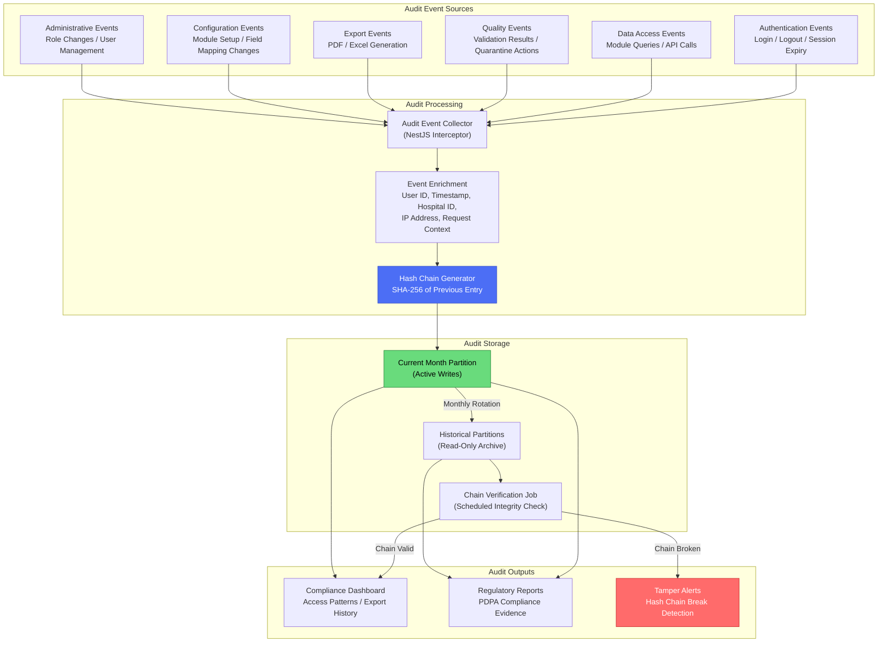

# Security & Governance Architecture

## Executive Summary

This document defines the security architecture, data governance framework, and compliance controls for MedicalPro -- the Clinical Analytics Operating System deployed for Farrer Park Hospital on AWS Singapore region (ap-southeast-1). It covers authentication, authorization, encryption, network isolation, data classification, audit mechanisms, AI governance, and regulatory compliance.

MedicalPro handles sensitive hospital operational data across five domains (staffing, bed allocation, supply chain, revenue/cost analysis, anomaly detection). The security architecture enforces defense-in-depth: encrypted data at rest and in transit, role-based access control with strict financial data isolation, hash-chained immutable audit logs, healthcare-specific AI guardrails, and full sandbox session isolation for public-facing demo access.

This document should be read alongside the [Platform Architecture Overview](./overview.md), [Data Flows](./data-flows.md), and [Network Security](./network-security.md) documents. Constraint and risk identifiers (C-xxx, R-xxx) reference the [Risk & Constraint Register](../project-context/risk-constraint-register.md).

---

## Table of Contents

- [1. Authentication & Authorization](#1-authentication--authorization)
- [2. Data Encryption](#2-data-encryption)
- [3. Data Classification](#3-data-classification)
- [4. Network Security & Isolation](#4-network-security--isolation)
- [5. Data Governance Framework](#5-data-governance-framework)
- [6. Data Lineage](#6-data-lineage)
- [7. AI Governance](#7-ai-governance)
- [8. Audit Mechanisms](#8-audit-mechanisms)
- [9. Compliance Controls](#9-compliance-controls)
- [10. Cross-References](#10-cross-references)

---

## 1. Authentication & Authorization

### 1.1 Authentication Approach

MedicalPro uses JWT-based (JSON Web Token) authentication for all protected API routes. The NestJS API layer issues JWTs upon successful credential verification. Tokens are stored and validated against a Redis-backed session store, enabling centralized session revocation and expiry management.

| Aspect | Implementation |
|---|---|
| **Token format** | JWT (signed, not encrypted -- sensitive data excluded from payload) |
| **Session storage** | Redis-backed token store (ElastiCache) |
| **Token lifecycle** | Issued on login, validated on every API request, revoked on logout or expiry |
| **API versioning** | All authenticated endpoints under `/api/v1/` |
| **Public routes** | Sandbox routes (`/sandbox/`) require no authentication |

Sandbox routes are intentionally public to support the self-service demo experience for prospective hospital clients. No authentication or authorization is required for any route under `/sandbox/`. Sandbox sessions operate on isolated synthetic data only -- see [Section 4.3 Sandbox Isolation](#43-sandbox-isolation).

### 1.2 Role-Based Access Control (RBAC)

Authorization is enforced through RBAC using NestJS decorators applied at the route handler level. Each API endpoint declares its required role(s); the framework validates the authenticated user's role before granting access.

#### Defined Roles

| Role | Scope | Description |
|---|---|---|
| `administrator` | Full operational access | Hospital administrators managing day-to-day operations across all non-financial modules |
| `director` | Full access including financial | Hospital directors with access to all modules including revenue/cost analysis |
| `data_administrator` | Data management and quality | Responsible for data ingestion configuration, quality monitoring, and module setup |
| `finance_analyst` | Financial module access | Access to revenue/cost analysis module and related financial endpoints |
| `implementation_consultant` | Configuration and onboarding | Configures module data requirements, manages field mappings, validates ingestion pipelines |
| `cfo` | Financial oversight | Chief Financial Officer with full financial module access and export capabilities |

#### Financial Data Access Restriction -- Constraint C-004

Revenue and cost analytics (Module 04) are restricted to users with `DIRECTOR`, `CFO`, or `FINANCE_ANALYST` roles. No exceptions are permitted. This constraint is enforced at the API layer via NestJS role guard decorators and cannot be overridden by application configuration.

```typescript
// Example: NestJS role guard on financial endpoint
@Roles(Role.DIRECTOR, Role.CFO, Role.FINANCE_ANALYST)
@UseGuards(JwtAuthGuard, RolesGuard)
@Get('/api/v1/revenue-cost/summary')
async getFinancialSummary(@Query() query: FinancialSummaryDto) {
  // Only accessible to DIRECTOR, CFO, FINANCE_ANALYST
}
```

#### RBAC Model

```mermaid
graph TD
    subgraph Users["User Authentication"]
        LOGIN["Login Request"]
        JWT["JWT Token Issued"]
        REDIS_S["Redis Session Store"]
    end

    subgraph Roles["Role Definitions"]
        ADMIN["administrator"]
        DIR["director"]
        DATADM["data_administrator"]
        FIN["finance_analyst"]
        IMPL["implementation_consultant"]
        CFO_R["cfo"]
    end

    subgraph Modules["Module Access Matrix"]
        M01["Module 01: Staffing"]
        M02["Module 02: Bed Allocation"]
        M03["Module 03: Supply Chain"]
        M04["Module 04: Revenue/Cost<br/>⚠ RESTRICTED"]
        M05["Module 05: Anomalies"]
        M06["Module 06: Simulations"]
        M07["Module 07: Sandbox"]
        M08["Module 08: Data Quality"]
        M09["Module 09: Ingestion"]
        M10["Module 10: NLP Queries"]
        M11["Module 11: Impact Graph"]
        M12["Module 12: Recommendations"]
        M13["Module 13: Configuration"]
    end

    subgraph Public["Public Access (No Auth)"]
        SANDBOX["/sandbox/* routes"]
    end

    LOGIN --> JWT
    JWT --> REDIS_S

    ADMIN --> M01 & M02 & M03 & M05 & M06 & M08 & M10 & M11 & M12
    DIR --> M01 & M02 & M03 & M04 & M05 & M06 & M08 & M10 & M11 & M12
    CFO_R --> M04
    FIN --> M04
    DATADM --> M08 & M09 & M13
    IMPL --> M09 & M13

    SANDBOX --> M07

    style M04 fill:#ff6b6b,stroke:#c92a2a,color:#fff
    style SANDBOX fill:#69db7c,stroke:#2b8a3e,color:#000
```



### 1.3 Session Management

- JWT tokens are stored in Redis with a configurable TTL.
- On logout or session expiry, the token is removed from Redis, immediately invalidating it regardless of JWT expiry time.
- Concurrent session limits can be enforced per user via Redis key counting.
- All session events (login, logout, expiry, revocation) are captured in the audit log.

---

## 2. Data Encryption

### 2.1 Encryption in Transit

All data in transit is encrypted using TLS 1.2 or higher. This applies to every communication channel in the platform.

| Channel | Protocol | Minimum Version |
|---|---|---|
| Client (browser) to CloudFront CDN | HTTPS | TLS 1.2 |
| CloudFront to ALB (API) | HTTPS | TLS 1.2 |
| ALB to NestJS (ECS tasks) | HTTPS | TLS 1.2 |
| NestJS to PostgreSQL (RDS) | TLS | TLS 1.2 |
| NestJS to Redis (ElastiCache) | TLS | TLS 1.2 |
| NestJS to Neo4j | Bolt + TLS | TLS 1.2 |
| Inter-service communication | HTTPS | TLS 1.2 |

### 2.2 Encryption at Rest

| Store | Encryption Method | Key Management |
|---|---|---|
| **PostgreSQL (RDS)** | RDS storage encryption (AES-256) for full-disk. Column-level encryption for sensitive financial figures using pgcrypto extension or application-layer AES-256. | AWS KMS managed keys with automatic annual rotation |
| **Redis (ElastiCache)** | In-transit encryption (TLS) enforced. No at-rest encryption required -- Redis stores ephemeral cache data and session tokens. All cached data is reconstructable from PostgreSQL. | N/A (ephemeral data) |
| **Neo4j** | EBS volume encryption (AES-256). TLS enforced on all Bolt protocol connections. | AWS KMS managed keys |
| **S3** | Server-side encryption: SSE-S3 (default) or SSE-KMS for raw data archives and cold storage. Bucket policies enforce encryption on all PUT operations. | AWS KMS for SSE-KMS; Amazon-managed keys for SSE-S3 |

### 2.3 Key Management

AWS Key Management Service (KMS) is the centralized key management solution:

- **Automatic key rotation**: Enabled for all KMS keys (annual rotation).
- **Key policies**: Restrict key usage to specific IAM roles and services.
- **Audit trail**: All key usage operations logged to CloudTrail.
- **Separation of duties**: Key administrators cannot use keys for encryption/decryption; key users cannot modify key policies.

---

## 3. Data Classification

All data handled by MedicalPro is classified into four tiers. Classification determines encryption requirements, access controls, caching policies, and export handling.

| Classification | Examples | Access Control | Caching | Export | Encryption |
|---|---|---|---|---|---|
| **Public** | Sandbox synthetic data, demo content, marketing materials | None (sandbox routes are unauthenticated) | Standard browser caching permitted | No restrictions | TLS in transit |
| **Internal** | Operational module data (staffing schedules, bed occupancy, supply inventory) | Authenticated users with appropriate module role | Server-side cache (Redis, 5-30 min TTL) | Standard export with hospital ID watermark | TLS in transit, AES-256 at rest |
| **Confidential** | Financial data, revenue/cost analysis, variance reports | DIRECTOR, CFO, FINANCE_ANALYST only (Constraint C-004) | No browser caching (`Cache-Control: no-store`). Server-side cache with reduced TTL. | PDF/Excel exports watermarked with user identity, timestamp, and hospital ID | TLS in transit, AES-256 at rest, column-level encryption for sensitive figures |
| **Restricted** | Patient health information (PHI), patient-identifiable records | Subject to PDPA Singapore compliance. AI guardrails block exposure (Constraint C-002). | No caching at any layer | Not exportable in identifiable form | TLS in transit, AES-256 at rest, column-level encryption, access logging |

### Confidential Data Controls

Financial data classified as Confidential receives additional protections:

- **No browser caching**: HTTP response headers include `Cache-Control: no-store` to prevent client-side data persistence.
- **Export watermarking**: All PDF and Excel exports of financial data are watermarked with the exporting user's identity, the export timestamp, and the hospital identifier.
- **Audit logging**: Every access to financial endpoints is logged with the requesting user, timestamp, data scope, and operation type.

### Restricted Data Controls

Patient health information (PHI) classified as Restricted is subject to the strictest controls:

- **PDPA Singapore compliance**: All PHI remains within the AWS ap-southeast-1 region (Constraint C-001).
- **AI guardrails**: The PHI exposure filter blocks any Claude API query that could reveal patient-identifiable information (Constraint C-002). See [Section 7: AI Governance](#7-ai-governance).
- **No direct access**: PHI is never surfaced in analytics outputs in identifiable form. All patient-related analytics use aggregated or de-identified data.

---

## 4. Network Security & Isolation

For full VPC configuration details, security group rules, and NACL specifications, see the [Network Security](./network-security.md) document. This section covers the architectural approach.

### 4.1 VPC Architecture

MedicalPro is deployed within an AWS VPC in the ap-southeast-1 (Singapore) region with public and private subnet tiers.

| Tier | Subnet Type | Components | Internet Access |
|---|---|---|---|
| **Edge** | Public | CloudFront CDN (Next.js frontend distribution) | Public-facing |
| **Load Balancer** | Public | Application Load Balancer (ALB) for NestJS API | Public-facing (routes to private subnets) |
| **Application** | Private | NestJS on ECS Fargate tasks | Outbound only (via NAT Gateway) |
| **Database** | Private | RDS PostgreSQL, Neo4j, ElastiCache Redis | No public internet access |

**Key principles:**

- The application tier (NestJS on ECS) runs in private subnets with no direct inbound internet access. The ALB in the public subnet is the sole entry point for API traffic, forwarding requests to private ECS tasks.
- The database tier (RDS PostgreSQL, Neo4j, ElastiCache Redis) runs in private subnets with no public internet access whatsoever. Database instances are accessible only from the application tier within the VPC.
- CloudFront serves as the public entry point for the Next.js frontend, providing CDN caching, DDoS protection, and TLS termination.

### 4.2 Security Groups

Security groups enforce strict least-privilege inbound rules:

| Security Group | Inbound Rules | Outbound Rules |
|---|---|---|
| **ALB SG** | HTTPS (443) from internet (0.0.0.0/0) | Application tier SG on application port |
| **Application SG** | Application port from ALB SG only | Database tier SGs on respective ports; HTTPS (443) to internet (for Claude API, AWS services) |
| **PostgreSQL SG** | Port 5432 from Application SG only | None (stateful return traffic only) |
| **Redis SG** | Port 6379 from Application SG only | None (stateful return traffic only) |
| **Neo4j SG** | Bolt port (7687) from Application SG only | None (stateful return traffic only) |

No security group permits direct internet-to-database traffic. All database access is mediated through the application layer.

### 4.3 Sandbox Isolation

Sandbox sessions for prospective clients operate on fully isolated resources to prevent any data leakage between sessions or between sandbox and production environments. Isolation is enforced at the data layer:

| Store | Isolation Strategy | Cleanup |
|---|---|---|
| **PostgreSQL** | Schema-per-session (`sandbox_{sessionId}`) | Schema dropped on session expiry or TTL |
| **Redis** | Namespace-per-session (`sandbox:{sessionId}:*`) | Keys deleted on session expiry |
| **Neo4j** | Partition labels scoped to session | Labels and nodes removed on session expiry |

**Constraint C-010**: Maximum 50 concurrent sandbox sessions globally. Each session consumes dedicated schema, namespace, and partition resources. Session creation is rejected when the limit is reached.

**Constraint C-006**: Sessions have a 4-hour TTL with a maximum of 1 extension (1 hour). Each session is limited to 10 simulations. These limits manage compute costs and encourage demo-to-sales conversion.

---

## 5. Data Governance Framework

### 5.1 Four-Layer Quality Architecture

Data quality is monitored across four progressive refinement zones as described in the [Platform Architecture Overview](./overview.md). Quality is assessed at every zone boundary.

```
Raw --> Processing --> Action --> Simulation
 |          |            |           |
 v          v            v           v
Quality   Quality     Quality     Quality
Check     Check       Check       Check
```

| Layer | Data State | Quality Focus |
|---|---|---|
| **Raw** | Original format, unmodified | Completeness: are all expected fields and records present? |
| **Processing** | Validated, standardized, enriched | Accuracy and consistency: do values conform to expected ranges and coding systems? |
| **Action** | Predictive model outputs | Timeliness and accuracy: are predictions generated on schedule with acceptable confidence? |
| **Simulation** | What-if scenario results | Consistency: do simulation outputs align with model constraints and historical patterns? |

### 5.2 Quality Rule Categories

Five categories of quality rules are applied across the four-layer pipeline:

| Category | Description | Example |
|---|---|---|
| **Completeness** | Required fields are present and non-null | Staffing record missing `shift_start_time` |
| **Accuracy** | Values fall within expected ranges and formats | Bed occupancy rate > 100% flagged |
| **Consistency** | Cross-field and cross-record relationships are valid | Department code in staffing record matches known department list |
| **Timeliness** | Data arrives and is processed within expected windows | Morning shift data not received by 08:00 cutoff |
| **Custom** | Hospital-specific rules defined during onboarding | Farrer Park requires ward code prefix "FP-" |

### 5.3 Quality Scoring

- Quality scores are computed **per module per dimension at every layer boundary**.
- Scores are aggregated into composite quality indices viewable on the Data Quality Governance Dashboard (Module 08).
- Configurable quality benchmarks per hospital allow thresholds to be tuned for local data maturity.
- Quality trend monitoring provides views across 7-day, 30-day, 90-day, and 1-year windows.

### 5.4 Issue Management

When quality checks detect issues:

1. Records failing validation are quarantined immediately -- they never block the pipeline or contaminate downstream analytics.
2. Quality issues are surfaced on the governance dashboard with severity classification.
3. Claude-powered root cause analysis generates hypotheses for issue origin and recommended remediation steps.
4. Issue resolution is tracked and feeds back into quality trend monitoring.

---

## 6. Data Lineage

### 6.1 Output-First Traceability

MedicalPro follows a Kimball (output-first) methodology: every data field is traced back to the predictive model output it enables. Module Configuration (Module 13) establishes the field-to-output lineage mapping before data collection begins.

This traceability operates in both directions:

- **Forward lineage (input-to-output)**: "This staffing record feeds the 72-hour demand forecast model."
- **Backward lineage (output-to-input)**: "This bed occupancy prediction requires ADT event data, department census, and seasonal adjustment factors."

The 70/30 standard/custom field ratio (Constraint C-005) is enforced through Module Configuration to maintain model accuracy while accommodating hospital-specific requirements.

### 6.2 Ingestion Pipeline Lineage

The data ingestion pipeline logs comprehensive lineage metadata for every job:

| Lineage Attribute | Description |
|---|---|
| **Job ID** | Unique identifier for the ingestion run |
| **Timestamps** | Job start, end, and duration |
| **Record counts** | Total records received, validated, quarantined, loaded |
| **Pass/fail metrics** | Per-rule validation pass and fail counts |
| **Error details** | Specific validation failures with affected record identifiers |
| **Source metadata** | Source system, format, file/API endpoint |

BullMQ provides additional operational lineage through built-in retry tracking and failure visibility. Failed jobs are moved to dead-letter queues with full error context for debugging.

### 6.3 Pipeline Stage Quality Scores

Quality scores are recorded at each pipeline stage, creating a quality lineage trail:

```
Raw Layer Score --> Processing Layer Score --> Action Layer Score --> Simulation Layer Score
```

Quality degradation between layers triggers alerts and root cause investigation. Scores are retained for trend analysis across 7-day, 30-day, 90-day, and 1-year windows.

---

## 7. AI Governance

All AI-powered features in MedicalPro use the Claude API (Anthropic) and are subject to strict healthcare governance controls. The intelligence layer architecture is described in the [Platform Architecture Overview](./overview.md#5-intelligence-layer).

### 7.1 Healthcare Guardrails -- Constraint C-002

All Claude API interactions pass through healthcare-specific guardrails before any AI-generated content reaches users. No raw LLM output is presented directly. This is a hard architectural constraint with no override mechanism.

| Guardrail | Function | Enforcement |
|---|---|---|
| **PHI exposure filter** | Blocks queries that could reveal patient-identifiable information | Pre-processing filter on all inbound queries; post-processing filter on all responses |
| **Confidence gate** | Responses below a configurable confidence threshold are not surfaced to users | Post-processing check; low-confidence responses return a "insufficient confidence" message instead |
| **Hallucination prevention** | Data citations required on all NLP answers -- every claim must trace to source data | Post-processing validation; uncitable claims are stripped from responses |
| **Harmful query filter** | Blocks queries that could produce harmful recommendations in a healthcare context | Pre-processing classification of query intent |

### 7.2 Rate Limiting

AI query volume is controlled to manage API costs and prevent abuse:

| Limit | Scope | Value |
|---|---|---|
| NLP queries per user per hour | Per authenticated user | 30 |
| NLP queries per hospital per hour | Per hospital tenant | 200 |

Rate limit state is tracked in Redis. Exceeded limits return HTTP 429 responses with retry-after headers.

### 7.3 AI Response Caching

AI responses are cached to reduce Claude API costs and improve response times:

| Cache Type | TTL | Rationale |
|---|---|---|
| **Narrative cache** | 24 hours | Financial narratives and anomaly classifications change infrequently |
| **Query cache** | 5 minutes | NLP query results may change as underlying data updates |

Cache invalidation occurs when underlying data changes (e.g., new ingestion job completes for the relevant module).

### 7.4 Provider Abstraction

The AI service interface is abstracted behind a provider-agnostic layer. This design decision (see Risk R-003 in the [Risk & Constraint Register](../project-context/risk-constraint-register.md)) allows the LLM provider to be swapped without application-level code changes. The abstraction layer handles:

- Prompt formatting and response parsing per provider
- Guardrail enforcement (provider-independent)
- Rate limiting and caching (provider-independent)
- Cost tracking and usage metrics

---

## 8. Audit Mechanisms

### 8.1 Audit Log Architecture -- Constraint C-009

The audit log is a hash-chained, append-only table in PostgreSQL. No UPDATE or DELETE operations are permitted on the audit log table. This constraint is enforced at the database level through revoked permissions and application-layer write-only access patterns.

| Property | Implementation |
|---|---|
| **Immutability** | No UPDATE or DELETE permissions granted on audit tables. Application DAL exposes INSERT only. |
| **Tamper evidence** | Each audit entry includes a SHA-256 hash of the previous entry, forming a hash chain. Tampering with any entry breaks the chain for all subsequent entries. |
| **Partitioning** | Monthly table partitioning for query performance. Old partitions remain accessible but are moved to cheaper storage tiers. |
| **Retention** | 7-year retention period for healthcare regulatory compliance. |

### 8.2 Audit Log Flow



### 8.3 Audit Event Content

Every audit log entry captures:

| Field | Description |
|---|---|
| `event_id` | Unique event identifier (UUID) |
| `event_type` | Category: authentication, data_access, export, quality, configuration, administration |
| `user_id` | Authenticated user who performed the action |
| `hospital_id` | Hospital tenant context |
| `timestamp` | ISO 8601 timestamp with timezone |
| `resource` | What was accessed (module, endpoint, data scope) |
| `action` | What operation was performed (read, export, configure) |
| `quality_context` | Quality checks applied to the accessed data (if applicable) |
| `ip_address` | Client IP address |
| `request_metadata` | API endpoint, HTTP method, query parameters |
| `previous_hash` | SHA-256 hash of the previous audit entry (hash chain link) |
| `entry_hash` | SHA-256 hash of the current entry (for next entry's chain) |

### 8.4 Export Watermarking

All data exports (PDF and Excel) are watermarked for traceability:

- **User identity**: Full name and user ID of the exporting user
- **Timestamp**: Date and time of export in ISO 8601 format
- **Hospital ID**: Tenant identifier

Watermarks are embedded as both visible overlays (PDF) and hidden metadata (Excel document properties). Export events are logged in the audit trail with the exported data scope and row counts.

### 8.5 Data Access Logging

All data access is logged for compliance retrieval:

- Read access to any module endpoint is logged with the query parameters and result set scope.
- Financial data access (Confidential classification) receives enhanced logging with the specific data dimensions accessed.
- Export operations are logged with file format, row count, and data scope.
- Sandbox access is logged separately from production access.

---

## 9. Compliance Controls

### 9.1 PDPA Singapore -- Constraint C-001

The Personal Data Protection Act (PDPA) of Singapore governs the collection, use, disclosure, and care of personal data. MedicalPro's compliance posture:

| PDPA Requirement | MedicalPro Implementation |
|---|---|
| **Data residency** | All data hosted in AWS ap-southeast-1 (Singapore). No cross-region replication. No data leaves Singapore jurisdiction. |
| **Purpose limitation** | Data used only for hospital operational analytics as defined in module configurations. |
| **Access control** | RBAC enforces role-based data access. Financial data restricted to authorized roles only (C-004). |
| **Data protection** | TLS 1.2+ in transit, AES-256 at rest, column-level encryption for sensitive fields. |
| **Audit trail** | Hash-chained, immutable audit log with 7-year retention (C-009). |
| **Breach notification** | Tamper-evident audit chain enables rapid detection. Incident response procedures documented separately. |

### 9.2 Integration Constraints -- Constraint C-003

The platform operates without requiring hospitals to install on-premises software. All integrations work through:

- **Standard APIs**: FHIR R4, HL7v2, REST
- **File-based transfer**: CSV, SFTP

This constraint ensures broad compatibility across hospital IT environments with varying maturity levels and reduces the security surface area by eliminating on-premises agent software.

### 9.3 Data Configuration Controls -- Constraint C-005

The 70/30 standard/custom field ratio is enforced through Module Configuration (Module 13):

- **Standard fields** (70% minimum): Pre-defined fields required by predictive models, validated against the output-first (Kimball) traceability matrix.
- **Custom fields** (30% maximum): Hospital-specific fields that extend the standard model without degrading prediction accuracy.
- Custom field counts exceeding the 30% threshold trigger a configuration review to assess impact on model accuracy.

### 9.4 Sandbox Session Controls -- Constraint C-006

| Control | Limit | Enforcement |
|---|---|---|
| Session duration | 4 hours | TTL enforced by session manager; resources cleaned up on expiry |
| Extensions | Maximum 1 extension (1 hour) | Extension count tracked per session |
| Simulations per session | 10 | Counter incremented per simulation; requests rejected at limit |
| Concurrent sessions | 50 globally (Constraint C-010) | Session creation rejected when limit reached |

### 9.5 Compliance Control Summary

| Constraint ID | Control | Enforcement Layer |
|---|---|---|
| C-001 | Data residency in AWS ap-southeast-1 | Infrastructure (AWS region lock) |
| C-002 | Healthcare guardrails on all AI outputs | Application (guardrail middleware) |
| C-003 | No on-premises software required | Architecture (API/file integration only) |
| C-004 | Financial data restricted to DIRECTOR/CFO/FINANCE_ANALYST | Application (NestJS RBAC decorators) |
| C-005 | 70/30 standard/custom field ratio | Application (Module 13 configuration validation) |
| C-006 | Sandbox session time and simulation limits | Application (session manager) |
| C-009 | Immutable append-only audit log | Database (revoked UPDATE/DELETE permissions) + Application (write-only DAL) |
| C-010 | 50 concurrent sandbox sessions maximum | Application (session counter with Redis) |

---

## 10. Cross-References

| Document | Relevance |
|---|---|
| [Platform Architecture Overview](./overview.md) | High-level system architecture, component relationships, design principles |
| [Data Flows](./data-flows.md) | End-to-end data flow diagrams, ingestion pipeline details, storage strategy |
| [Network Security](./network-security.md) | Detailed VPC configuration, security group rules, NACL specifications, firewall policies |
| [Risk & Constraint Register](../project-context/risk-constraint-register.md) | Full constraint definitions (C-001 through C-010) and risk mitigation strategies |
| [Data Platform Strategy](../project-context/data-platform-strategy.md) | Business requirements, strategic decisions, expected outcomes |
