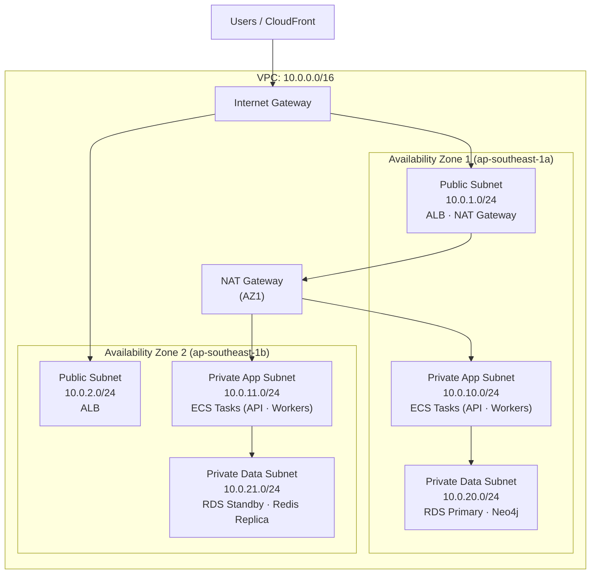
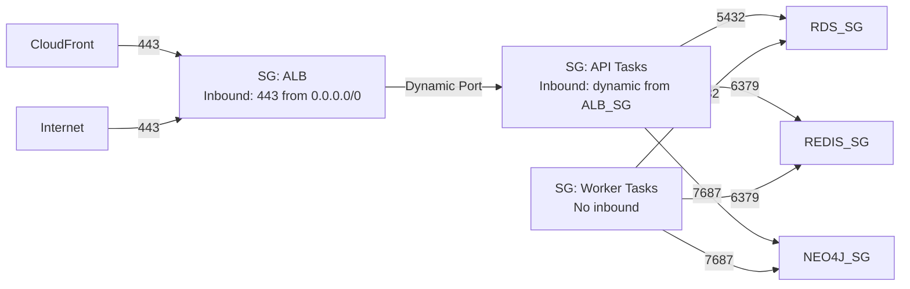

# Network Security Architecture

This document details the network topology, isolation design, and security controls for the MedicalPro platform deployed on AWS (Singapore region: `ap-southeast-1`). For the high-level architecture, see [Architecture Overview](../../../docs/architecture/overview.md). For encryption and governance details, see [Security & Governance](../../../docs/architecture/security-governance.md).

---

## 1. Network Topology

### VPC Design

MedicalPro deploys within a single AWS VPC in `ap-southeast-1` with public and private subnets across two Availability Zones for high availability.

### Subnet Allocation

| Subnet | CIDR | AZ | Purpose | Internet Access |
|---|---|---|---|---|
| Public 1 | `10.0.1.0/24` | 1a | ALB, NAT Gateway | Direct (IGW) |
| Public 2 | `10.0.2.0/24` | 1b | ALB | Direct (IGW) |
| Private App 1 | `10.0.10.0/24` | 1a | ECS API + Worker tasks | Outbound via NAT |
| Private App 2 | `10.0.11.0/24` | 1b | ECS API + Worker tasks | Outbound via NAT |
| Private Data 1 | `10.0.20.0/24` | 1a | RDS Primary, Neo4j (ECS), ElastiCache Primary | None (VPC endpoints for AWS services) |
| Private Data 2 | `10.0.21.0/24` | 1b | RDS Standby, ElastiCache Replica | None |

### Internet Access Strategy

- **Inbound**: All public internet traffic enters through CloudFront (static assets) or ALB (API). No direct access to application or data subnets from the internet.
- **Outbound**: Application tasks require outbound access for Claude API calls, FHIR/HL7 source API calls, and CRM webhooks. This routes through a single NAT Gateway in AZ1. A second NAT Gateway in AZ2 can be added for HA if required.
- **Data tier**: No outbound internet access. AWS service communication via VPC endpoints.

---

## 2. Virtual Network Configuration

### VPC Settings

| Setting | Value |
|---|---|
| VPC CIDR | `10.0.0.0/16` (65,536 addresses) |
| DNS resolution | Enabled |
| DNS hostnames | Enabled |
| Tenancy | Default (shared) |
| Region | `ap-southeast-1` (Singapore) |

### Route Tables

**Public Route Table** (associated with public subnets):

| Destination | Target |
|---|---|
| `10.0.0.0/16` | local |
| `0.0.0.0/0` | Internet Gateway |

**Private App Route Table** (associated with private app subnets):

| Destination | Target |
|---|---|
| `10.0.0.0/16` | local |
| `0.0.0.0/0` | NAT Gateway |

**Private Data Route Table** (associated with private data subnets):

| Destination | Target |
|---|---|
| `10.0.0.0/16` | local |
| (No default route) | — |

---

## 3. Firewall Rules and Security Groups

### Security Group Architecture

### Security Group Definitions

#### SG-ALB: Application Load Balancer

| Direction | Protocol | Port | Source/Destination | Description |
|---|---|---|---|---|
| Inbound | TCP | 443 | `0.0.0.0/0` | HTTPS from internet |
| Inbound | TCP | 80 | `0.0.0.0/0` | HTTP redirect to HTTPS |
| Outbound | TCP | 32768–65535 | SG-API | Health checks and request routing |

#### SG-API: NestJS API ECS Tasks

| Direction | Protocol | Port | Source/Destination | Description |
|---|---|---|---|---|
| Inbound | TCP | 3000 | SG-ALB | API traffic from ALB |
| Outbound | TCP | 5432 | SG-RDS | PostgreSQL queries |
| Outbound | TCP | 6379 | SG-Redis | Redis cache and BullMQ |
| Outbound | TCP | 7687 | SG-Neo4j | Neo4j Bolt protocol |
| Outbound | TCP | 443 | `0.0.0.0/0` (via NAT) | Claude API, external APIs |

#### SG-Worker: BullMQ Worker ECS Tasks

| Direction | Protocol | Port | Source/Destination | Description |
|---|---|---|---|---|
| Inbound | — | — | — | No inbound traffic (workers pull from queues) |
| Outbound | TCP | 5432 | SG-RDS | PostgreSQL queries |
| Outbound | TCP | 6379 | SG-Redis | BullMQ queue polling |
| Outbound | TCP | 7687 | SG-Neo4j | Neo4j graph queries |
| Outbound | TCP | 443 | `0.0.0.0/0` (via NAT) | Claude API calls |

#### SG-RDS: PostgreSQL Database

| Direction | Protocol | Port | Source/Destination | Description |
|---|---|---|---|---|
| Inbound | TCP | 5432 | SG-API | API task connections |
| Inbound | TCP | 5432 | SG-Worker | Worker task connections |
| Outbound | — | — | — | No outbound required |

#### SG-Redis: ElastiCache Redis

| Direction | Protocol | Port | Source/Destination | Description |
|---|---|---|---|---|
| Inbound | TCP | 6379 | SG-API | Cache reads/writes, SSE pub/sub |
| Inbound | TCP | 6379 | SG-Worker | BullMQ job polling |
| Outbound | — | — | — | No outbound required |

#### SG-Neo4j: Neo4j Graph Database

| Direction | Protocol | Port | Source/Destination | Description |
|---|---|---|---|---|
| Inbound | TCP | 7687 | SG-API | Bolt protocol queries |
| Inbound | TCP | 7687 | SG-Worker | Cascade computation, sync |
| Inbound | TCP | 7474 | SG-API | Neo4j Browser (dev only, disabled in prod) |
| Outbound | — | — | — | No outbound required |

---

## 4. Private Endpoints and Service Endpoints

### VPC Endpoints

VPC endpoints eliminate the need for data tier resources to access AWS services via the public internet.

| Endpoint Type | Service | Purpose |
|---|---|---|
| Gateway | S3 (`com.amazonaws.ap-southeast-1.s3`) | Raw data archival, export storage, frontend hosting |
| Interface | CloudWatch Logs (`com.amazonaws.ap-southeast-1.logs`) | Container log shipping |
| Interface | KMS (`com.amazonaws.ap-southeast-1.kms`) | Encryption key operations |
| Interface | ECR (`com.amazonaws.ap-southeast-1.ecr.api`, `.ecr.dkr`) | Container image pull |
| Interface | Secrets Manager (`com.amazonaws.ap-southeast-1.secretsmanager`) | Database credential retrieval |

### Interface Endpoint Security

All VPC interface endpoints:
- Placed in private data subnets.
- Associated with a dedicated security group allowing inbound TCP 443 from SG-API and SG-Worker only.
- Private DNS enabled — AWS service calls resolve to VPC-internal IP addresses.

---

## 5. DNS Configuration

### External DNS

| Domain | Record | Target | Purpose |
|---|---|---|---|
| `app.medicalpro.sg` | A (Alias) | CloudFront distribution | Frontend application |
| `api.medicalpro.sg` | A (Alias) | ALB | NestJS API endpoint |
| `ws.medicalpro.sg` | A (Alias) | ALB (WebSocket target group) | Real-time events |
| `sandbox.medicalpro.sg` | CNAME | `app.medicalpro.sg` | Sandbox demo (same CDN) |

### Internal DNS

- **RDS**: `medicalpro-db.xxxxx.ap-southeast-1.rds.amazonaws.com` — resolved within VPC only.
- **ElastiCache**: `medicalpro-redis.xxxxx.0001.apse1.cache.amazonaws.com` — resolved within VPC only.
- **Neo4j**: Service discovery via ECS Cloud Map — `neo4j.medicalpro.local` — resolved within VPC only.

All internal DNS names are non-routable outside the VPC.

### SSL/TLS Certificates

| Domain | Certificate | Provider |
|---|---|---|
| `*.medicalpro.sg` | Wildcard ACM certificate | AWS Certificate Manager |
| ALB listener | ACM certificate (auto-renewed) | AWS ACM |
| CloudFront distribution | ACM certificate (us-east-1 region) | AWS ACM |

---

## 6. Additional Security Controls

### Network ACLs

Network ACLs provide a secondary defense layer at the subnet level (in addition to security groups):

| Subnet Tier | Inbound Allow | Outbound Allow |
|---|---|---|
| Public | TCP 80, 443 from `0.0.0.0/0`; ephemeral from VPC | TCP all to VPC; TCP 443 to `0.0.0.0/0`; ephemeral to `0.0.0.0/0` |
| Private App | TCP all from VPC | TCP all to VPC; TCP 443 to `0.0.0.0/0` (NAT) |
| Private Data | TCP 5432, 6379, 7687 from private app subnets | Ephemeral to private app subnets |

### AWS WAF (Web Application Firewall)

Attached to ALB:
- **Rate limiting**: 1,000 requests/IP/5 minutes.
- **SQL injection protection**: AWS managed rule set.
- **Known bad inputs**: AWS IP reputation list.
- **Geo-restriction**: Allow traffic from SEA region + configured IP ranges. Block known malicious IPs.
- **Bot control**: Block automated scanning tools.

### VPN Access (Development/Operations)

- AWS Client VPN endpoint for developer access to private subnets.
- Client VPN uses mutual TLS authentication with ACM-issued certificates.
- VPN access logged in CloudWatch for audit trail.
- Production database access only via VPN + bastion pattern (no direct SSH to containers).

---

## Cross-References

- [Architecture Overview](../../../docs/architecture/overview.md) — High-level platform architecture.
- [Security & Governance](../../../docs/architecture/security-governance.md) — Authentication, data classification, and compliance.
- [Component Specifications](./component-specifications.md) — Detailed per-component configuration.
- [Operations](./operations.md) — Monitoring, alerting, and incident response.
