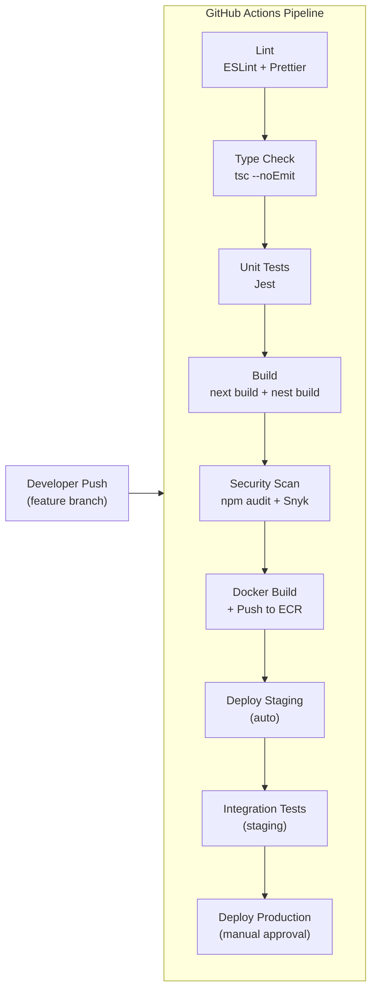

# Operations

This document covers monitoring, alerting, disaster recovery, CI/CD pipeline design, cost optimization, and performance tuning for the MedicalPro platform. For infrastructure details, see [Component Specifications](./component-specifications.md). For network architecture, see [Network Security](./network-security.md).

---

## 1. Monitoring and Logging Strategy

### Monitoring Stack

MedicalPro uses **Amazon CloudWatch** as the centralized monitoring platform, extended with application-level custom metrics.

### Infrastructure Metrics

| Component | Metrics | Collection Interval |
|---|---|---|
| **ECS (API tasks)** | CPU utilization, memory utilization, task count, health check pass rate | 60 seconds |
| **ECS (Worker tasks)** | CPU utilization, memory utilization, task count | 60 seconds |
| **RDS PostgreSQL** | CPU, free memory, storage, read/write IOPS, replication lag, connections, deadlocks | 60 seconds |
| **ElastiCache Redis** | CPU, memory, evictions, cache hit rate, current connections, replication lag | 60 seconds |
| **Neo4j (ECS)** | CPU, memory, Bolt connection count, query latency (custom) | 60 seconds |
| **ALB** | Request count, latency (p50/p95/p99), 4xx/5xx error rate, healthy host count | 60 seconds |
| **CloudFront** | Request count, error rate, cache hit ratio, bytes transferred | 300 seconds |

### Application Metrics (Custom CloudWatch Metrics)

| Metric | Namespace | Dimensions | Purpose |
|---|---|---|---|
| `api.request.latency` | `MedicalPro/API` | module, endpoint, method | Track per-endpoint response time |
| `api.request.count` | `MedicalPro/API` | module, status_code | Request volume and error rate |
| `bullmq.queue.depth` | `MedicalPro/Queues` | queue_name | Job backlog per queue |
| `bullmq.job.duration` | `MedicalPro/Queues` | queue_name | Job processing time |
| `bullmq.job.failed` | `MedicalPro/Queues` | queue_name | Failed job count |
| `bullmq.dlq.depth` | `MedicalPro/Queues` | queue_name | Dead-letter queue depth |
| `ingestion.records.processed` | `MedicalPro/Ingestion` | format, status | Ingestion throughput |
| `ingestion.quarantine.count` | `MedicalPro/Ingestion` | reason | Quarantined record volume |
| `quality.score` | `MedicalPro/Quality` | module, dimension, stage | Data quality scores |
| `claude.request.latency` | `MedicalPro/AI` | task_type | Claude API response time |
| `claude.request.cost` | `MedicalPro/AI` | task_type | Token cost per request |
| `neo4j.query.latency` | `MedicalPro/Neo4j` | query_type | Graph query performance |
| `simulation.duration` | `MedicalPro/Simulation` | scenario_type | Simulation execution time |
| `sandbox.active.sessions` | `MedicalPro/Sandbox` | — | Concurrent sandbox sessions |
| `cache.hit.rate` | `MedicalPro/Cache` | cache_key_prefix | Redis cache effectiveness |

### Logging Strategy

**Structured JSON logging** across all components:

```json
{
  "timestamp": "2026-03-20T10:30:00.000Z",
  "level": "info",
  "service": "api",
  "module": "staff-allocation",
  "traceId": "abc123",
  "userId": "usr_xyz",
  "hospitalId": "hosp_fpk",
  "message": "Staffing prediction completed",
  "metadata": {
    "jobId": "job_456",
    "departmentId": "dept_icu",
    "recordCount": 150,
    "durationMs": 2400
  }
}
```

**Log groups**:

| Log Group | Source | Retention |
|---|---|---|
| `/medicalpro/api` | NestJS API tasks | 90 days |
| `/medicalpro/worker` | BullMQ worker tasks | 90 days |
| `/medicalpro/neo4j` | Neo4j container | 30 days |
| `/medicalpro/ingestion` | Ingestion pipeline detailed logs | 180 days |
| `/medicalpro/ai` | Claude API interaction logs (prompt hash, response hash, confidence) | 365 days |
| `/medicalpro/audit` | Security audit events (logins, role changes, data access) | 7 years |

**Log levels**: ERROR, WARN, INFO, DEBUG. Production runs at INFO; DEBUG enabled per-module for troubleshooting.

**Sensitive data**: Log sanitizer strips JWTs, passwords, PHI indicators, and financial values from log output. Only hashes and identifiers are logged.

---

## 2. Alert Configuration and Incident Response

### Alert Tiers

| Tier | Severity | Notification | Response Target |
|---|---|---|---|
| **P1 — Critical** | Service down or data corruption risk | PagerDuty + SMS + Slack | 15 minutes |
| **P2 — High** | Degraded performance or functionality | Slack + email | 1 hour |
| **P3 — Medium** | Warning conditions approaching thresholds | Slack | Next business day |
| **P4 — Low** | Informational, optimization opportunities | Email digest | Weekly review |

### Alert Definitions

| Alert | Condition | Tier | Action |
|---|---|---|---|
| API unavailable | ALB healthy host count = 0 for 2 min | P1 | Investigate ECS task failures; check health endpoint |
| Database unreachable | RDS connection failures > 0 for 3 min | P1 | Check RDS status; failover if Multi-AZ standby available |
| Redis OOM risk | ElastiCache memory > 90% | P1 | Check for BullMQ job leak; eviction policy active |
| API latency spike | p99 latency > 5s for 5 min | P2 | Check slow queries; review Redis cache hit rate |
| Queue backlog | Any queue depth > 1,000 for 10 min | P2 | Scale worker tasks; check for failed dependency |
| Dead-letter growth | Any DLQ depth > 50 | P2 | Investigate failed jobs; check external service (Claude API) |
| Error rate spike | 5xx rate > 5% for 5 min | P2 | Review API logs; check database connections |
| Ingestion slowdown | Throughput < 5,000 records/min (during active job) | P3 | Check PostgreSQL COPY performance; quarantine rate |
| Cache hit rate low | Redis hit rate < 70% for 30 min | P3 | Review cache key TTLs; check for key eviction |
| Replication lag | RDS replica lag > 30s for 10 min | P3 | Check write volume; consider replica instance upgrade |
| Neo4j slow query | Query latency > 10s | P3 | Review Cypher query plan; check graph size |
| Claude API cost | Daily AI cost > $50 | P3 | Review caching effectiveness; check for query loops |
| Sandbox capacity | Active sessions > 40 (of 50 max) | P4 | Monitor; prepare session cleanup if needed |
| Storage growth | RDS storage > 80% of max | P4 | Review data retention; plan storage expansion |

### Incident Response Process

1. **Detection**: CloudWatch alarm triggers notification via SNS → PagerDuty/Slack.
2. **Triage**: On-call engineer assesses severity, confirms impact scope.
3. **Mitigation**: Apply immediate fix (scale tasks, failover database, flush cache, disable degraded module).
4. **Resolution**: Root cause analysis, permanent fix applied and deployed.
5. **Post-mortem**: Document incident timeline, root cause, mitigation actions, and preventive measures. Filed in `docs/incidents/`.

---

## 3. Disaster Recovery and Backup Approach

### Backup Strategy

| Component | Backup Method | Frequency | Retention | Recovery Point (RPO) |
|---|---|---|---|---|
| **PostgreSQL** | RDS automated snapshots | Daily | 35 days | 5 minutes (point-in-time) |
| **PostgreSQL** | Continuous WAL archiving | Continuous | 35 days | < 5 minutes |
| **Redis** | AOF (append-only file) | Continuous | N/A (ephemeral, reconstructable) | Best-effort |
| **Neo4j** | EBS snapshot | Daily | 14 days | 24 hours |
| **S3 raw archives** | S3 versioning + cross-region replication | Continuous | 7 years | 0 (durable by design) |
| **Configuration** | Git repository (IaC) | Every commit | Permanent | 0 |

### Recovery Time Objectives

| Scenario | RTO | RPO | Procedure |
|---|---|---|---|
| **Single AZ failure** | < 5 minutes | 0 | Auto-failover: RDS Multi-AZ, ECS multi-AZ task placement |
| **Database corruption** | < 1 hour | < 5 minutes | Point-in-time recovery to new RDS instance from WAL |
| **Neo4j failure** | < 2 hours | < 24 hours | Restore from EBS snapshot; reconcile with PostgreSQL |
| **Redis failure** | < 5 minutes | Best-effort | ElastiCache replica promotion; cache repopulates from DB |
| **Full region failure** | < 4 hours | < 5 minutes | Cross-region RDS snapshot restore; redeploy ECS; update DNS |
| **Data deletion (human error)** | < 2 hours | < 5 minutes | Point-in-time restore to moment before deletion |

### Disaster Recovery Testing

- **Monthly**: Validate RDS point-in-time recovery to a temporary instance.
- **Quarterly**: Full DR drill — restore from snapshots in a secondary region, verify application functionality.
- **Annually**: Complete failover test with DNS switch.

---

## 4. CI/CD Pipeline Design

### Pipeline Architecture



### Pipeline Stages

| Stage | Trigger | Actions | Duration Target |
|---|---|---|---|
| **Lint + Format** | Every push | ESLint, Prettier check | < 1 min |
| **Type Check** | Every push | `tsc --noEmit` on frontend and backend | < 2 min |
| **Unit Tests** | Every push | Jest test suites (API, hooks, utilities) | < 5 min |
| **Build** | Every push | `next build` + `nest build` — zero errors required | < 3 min |
| **Security Scan** | Every push | `npm audit`, Snyk dependency scan | < 2 min |
| **Docker Build** | Main branch / PR merge | Build API + Worker images, push to ECR | < 5 min |
| **Deploy Staging** | Merge to main | ECS rolling update to staging environment | < 5 min |
| **Integration Tests** | Post staging deploy | API endpoint smoke tests, database migration verification | < 10 min |
| **Deploy Production** | Manual approval | ECS blue/green deployment | < 10 min |

### Deployment Strategy

- **Staging**: Rolling update — zero-downtime via ECS service rolling replacement.
- **Production**: Blue/green deployment — new task set runs alongside old; ALB traffic shifted after health check passes. Instant rollback by reverting ALB target group.
- **Database migrations**: Run as a pre-deployment ECS task (one-off). Migrations are forward-only and backward-compatible. Schema changes that break backward compatibility require a two-phase approach (add new → migrate data → remove old).

### Environment Configuration

| Environment | Purpose | Infrastructure Scale |
|---|---|---|
| **Development** | Local development | Docker Compose (PG, Redis, Neo4j) |
| **Staging** | Integration testing, QA | Single-AZ, minimal instances |
| **Production** | Live operations | Multi-AZ, auto-scaling, read replicas |
| **Sandbox** | Pre-sales demos | Isolated schemas within production infra |

### Infrastructure as Code

- **AWS CDK** (TypeScript) for all infrastructure definitions — VPC, ECS, RDS, ElastiCache, S3, CloudFront, ALB.
- CDK synth outputs CloudFormation templates stored in version control.
- Separate CDK stacks per environment (shared VPC stack, environment-specific service stacks).
- Database migrations versioned in `infra/migrations/` and applied via TypeORM migration runner.

---

## 5. Cost Optimization Strategies

### Compute Optimization

| Strategy | Savings Estimate | Implementation |
|---|---|---|
| **ECS Fargate Spot** for worker tasks | 50–70% on worker compute | Workers tolerate interruption (BullMQ retries); API tasks stay on-demand |
| **Auto-scaling based on queue depth** | Variable (avoid over-provisioning) | CloudWatch alarm triggers when queue depth > threshold |
| **Right-sizing** | 10–20% | Monthly review of CPU/memory utilization; downsize under-utilized tasks |

### Storage Optimization

| Strategy | Savings Estimate | Implementation |
|---|---|---|
| **S3 lifecycle policies** | 40–60% on raw archives | Standard → IA (30 days) → Glacier (1 year) → Expire (7 years) |
| **PostgreSQL table partitioning** | Performance gain (indirect cost saving) | Audit log monthly partitions; drop-partition for expired data |
| **Redis memory management** | Prevent instance upsizing | Module-specific TTLs; LRU eviction; monitor memory by key prefix |

### AI Cost Optimization

| Strategy | Savings Estimate | Implementation |
|---|---|---|
| **Response caching** | 30–50% reduction in API calls | Narrative cache 24hr TTL; NLP query cache 5min TTL |
| **Model tiering** | 40% per-call savings | Claude Sonnet for classification/NLP; Opus only for complex narratives |
| **Token optimization** | 10–20% | Minimal system prompts; structured output format reduces response tokens |
| **Rate limiting** | Cost cap | 30 queries/user/hr, 200/hospital/hr prevents runaway costs |

### Database Cost Optimization

| Strategy | Savings Estimate | Implementation |
|---|---|---|
| **Reserved instances** (RDS, ElastiCache) | 30–40% vs. on-demand | 1-year reserved after usage patterns stabilize |
| **Read replica routing** | Prevents primary overload | Analytical queries → replica; OLTP → primary |
| **Materialized view scheduling** | Reduces repeat computation | Hourly/daily refresh instead of per-query aggregation |

### Monthly Cost Projection

| Tier | Components | Estimated Cost |
|---|---|---|
| **Production** | All components, Multi-AZ, auto-scaling | $2,500–3,100/month |
| **Staging** | Minimal instances, single-AZ | $400–600/month |
| **Development** | Docker Compose (local) | $0 (cloud cost) |
| **Total** | | **$2,900–3,700/month** |

With reserved instances (year 2+): **$2,000–2,600/month**.

---

## 6. Performance Tuning Recommendations

### PostgreSQL Tuning

| Parameter | Recommendation | Impact |
|---|---|---|
| `shared_buffers` | 25% of instance memory (8 GB for r6g.xlarge) | Caches frequently accessed data pages |
| `effective_cache_size` | 75% of instance memory (24 GB) | Helps query planner choose index scans |
| `work_mem` | 256 MB | Improves sort/hash join performance for analytical queries |
| `maintenance_work_mem` | 1 GB | Faster VACUUM, CREATE INDEX, COPY |
| `max_connections` | 100 (use PgBouncer for pooling) | Prevents connection exhaustion |
| `random_page_cost` | 1.1 (SSD storage) | Encourages index usage on SSD-backed gp3 |
| `wal_buffers` | 64 MB | Reduces WAL write contention |

### Redis Tuning

| Parameter | Recommendation | Impact |
|---|---|---|
| `maxmemory-policy` | `allkeys-lru` | Graceful eviction when memory limit reached |
| `tcp-keepalive` | 300 | Detect dead connections |
| `timeout` | 0 (disabled for BullMQ) | BullMQ long-polling requires persistent connections |
| `hz` | 100 | More frequent key expiration checks |

### Neo4j Tuning

| Parameter | Recommendation | Impact |
|---|---|---|
| `dbms.memory.heap.max_size` | 4 GB | Sufficient for graph operations |
| `dbms.memory.pagecache.size` | 2 GB | Keeps graph topology in memory |
| `dbms.query.timeout` | 30s | Prevents runaway cascade queries |
| `dbms.cypher.min_replan_interval` | 10s | Balances query plan optimization with overhead |

### Application Tuning

| Area | Recommendation | Impact |
|---|---|---|
| **Connection pooling** | PgBouncer: 20 connections (writer), 10 (reader) | Prevents connection exhaustion under load |
| **BullMQ concurrency** | Per-queue limits (see component specs) | Prevents Redis saturation from parallel jobs |
| **SSE heartbeat** | 30-second interval | Keeps connections alive through ALB timeout |
| **React Query stale time** | 5 minutes (module dashboards) | Reduces unnecessary API calls |
| **Next.js ISR** | 60-second revalidation for executive dashboard | Balances freshness with server load |
| **Ingestion batch size** | 500 records per chunk | Optimal for PostgreSQL COPY throughput |
| **Virtual list threshold** | @tanstack/react-virtual for lists > 100 items | Prevents DOM bloat (anomaly feed: 1000+ items) |

---

## Cross-References

- [Architecture Overview](../../../docs/architecture/overview.md) — High-level platform architecture and design principles.
- [Data Flows](../../../docs/architecture/data-flows.md) — End-to-end data pipeline and storage strategy.
- [Security & Governance](../../../docs/architecture/security-governance.md) — Authentication, audit, and compliance.
- [Component Specifications](./component-specifications.md) — Detailed per-component configuration and sizing.
- [Network Security](./network-security.md) — VPC topology, security groups, and WAF.
- [Risk & Constraint Register](../../../docs/project-context/risk-constraint-register.md) — Operational risks (R-011 queue saturation, R-004 Neo4j performance).
